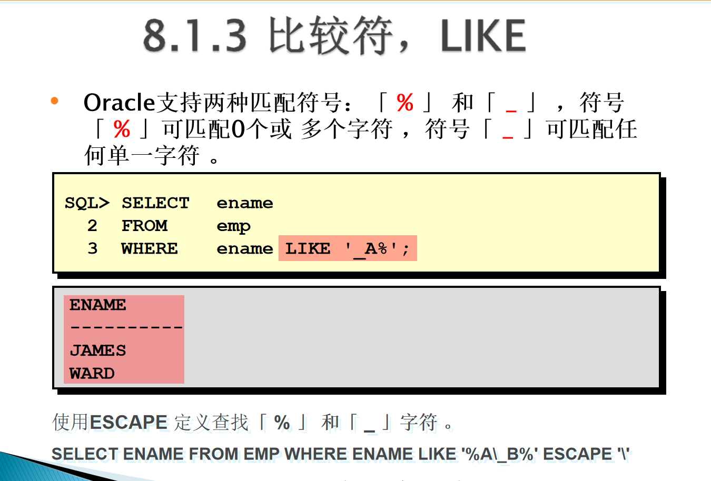
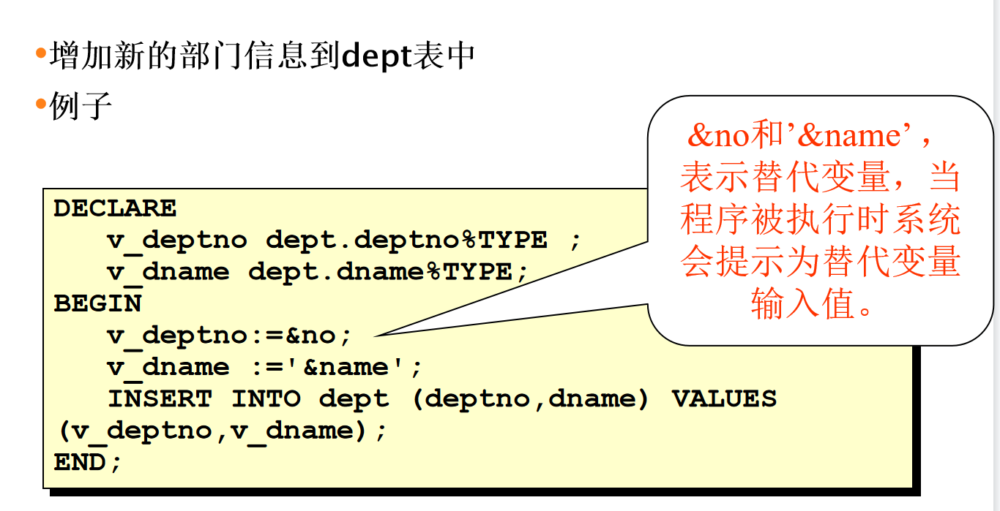

# Oracle复习

本次考试主要包括五种题型：
1、单选题 ，分析select语句执行后的查询结果
2、判断题，针对小算法的实现进行代码补全
3、方案对象，表的创建DDL，以及测试数据维护DML
4、查询设计，常用的查询设计，复杂语法可以参考单选题
5、PLSQL程序设计，触发器、函数、过程，能力差的同学要尽量把子程序基本语法结构给出来。其他知识点包括if分支、for循环、游标、异常等

查询设计是按查询结果字段，查询条件给分，不能写全对也要把结构给出来。复杂查询前面选择题有语法参考。小算法也主要考双循环

## 1.单选题

### SELECT基础语法

[]表示可选，{}表示必填

select  [distinct 去重]  {*所有字段，column列名 [alias别名]，...}

from table表名

[where condition(s)条件]

[order by {column列名，expr表达式，alias别名} [asc升序|desc降序]]

#### 定义列的别名

定义别名时，用“”双引号。

#### 连接符||

用连接符连接字符串时用‘’单引号。

#### 条件（WHERE）:比较符

不等于的符号千奇百怪。还是!=亲切

##### 比较符LIKE

定义：escape关键字经常用于使某些特殊字符，如通配符：’%’,’_‘转义为它们原来的字符的意义，被定义的转义字符通常使用’\‘,但是也可以使用其他的符号。

#### 条件（WHERE）:逻辑操作符

#### 条件（WHERE）:  优先规则

可能存在陷阱（感觉必考）：若没括号，and的优先级高于or，即and的两个语句先结合，如上图。

#### 排序（ORDER BY子句）

### SELECT进阶单行函数

#### 字符函数

##### 字符函数:分类

##### 字符函数:常用函数列表

##### 字符函数：用例

#### 数值函数

##### 数值函数:常用函数列表

##### 数值函数： ROUND函数（四舍五入）

##### 数值函数： TRUNC函数（截取）

##### 数值函数： MOD函数（取模）

#### 日期函数

##### 日期类型

##### 日期运算

##### 日期函数

#### 转换函数

##### 隐式转换-赋值

##### 隐式转换-表达式运算

##### 函数TO_CHAR (日期)

##### 函数TO_CHAR (数值)

##### 函数TO_NUMBER TO_DATE

##### 空值置换函数

#### 条件表达式

##### 条件表达式： CASE表达式

##### 条件表达式： DECODE函数

### SELECT进阶高级查询

#### 连接查询

##### 外连接

##### 递归查询（树查询）

##### 集合操作符

##### 分组函数

##### 限制选择组

##### 非法使用分组函数

select count（ename） from emp 不会报错，多个字段就会报错。

##### 单行子查询

##### 多行子查询

## 2.判断题

双循坏小算法

dbms_output.put()        不换行不输出

dbms_output.put_line() 输出加换行

dbms_output.new_line  换行并把缓存里的输出，本身不能输出东西

## 5.PLSQL程序设计

### 数据类型和变量

#### PL/SQL块结构

#### PL/SQL块块种类

#### 声明PL/SQL变量

#### 标量变量声明

#### 引用类型

### SQL的使用

#### select要用into

#### 使用&输入

### 控制语句

#### 分支结构

case结构

#### 循环控制结构

##### Basic Loop

##### FOR Loop

##### WHILE Loop

